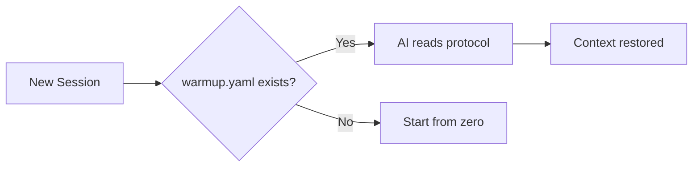

# Forge Protocol

Vendor-neutral AI session continuity. Any AI. Any project.

## The Problem

AI sessions are stateless. Every conversation starts from zero. Context about your project, conventions, and progress is lost.

## The Solution

A simple YAML file (`warmup.yaml`) that any AI can read to restore project context.

```yaml
# warmup.yaml - minimal example
identity:
  project: "My Project"

files:
  source:
    - "src/main.py - Entry point"

session:
  start:
    - "Read warmup.yaml"
    - "Run tests"
```

## Quick Start

1. Create `warmup.yaml` in your project root
2. Tell your AI: *"If there is a warmup.yaml file, read it first"*
3. That's it. Session continuity restored.

## Why YAML?

- Every AI can read it
- Humans can read it
- Git-friendly (diffable, mergeable)
- No vendor lock-in

## Protocol Suite

| File             | Purpose                | Required |
| ---------------- | ---------------------- | -------- |
| `warmup.yaml`    | Session bootstrap      | Yes      |
| `sprint.yaml`    | Active work tracking   | Optional |
| `roadmap.yaml`   | Milestones & planning  | Optional |

## Proven at Scale

The Forge Protocol powers an entire product ecosystem:

| Project | AI Role | Stack | Status |
| ------- | ------- | ----- | ------ |
| **[Forge](https://github.com/royalbit/forge)** (FOSS) | Principal Engineer | Rust | Production |
| Backend API | Principal Backend Engineer | Rust + Axum | Production |
| Mobile Prototype | Principal Mobile Engineer | Flutter | Production |
| Architecture Docs | Principal AI Architect | C4 + ADRs | Production |
| Business Strategy | AI Strategist | YAML | Production |
| Data Enrichment | Principal Engineer | Python | Active |

**Stats:**
- 10-phase autonomous build plan
- 4 mobile apps planned (Flutter)
- 1,100+ line master roadmap
- 850+ financial formulas validated
- 213+ tests across ecosystem

See [ECOSYSTEM.md](docs/ECOSYSTEM.md) for the full story.

## How It Works



## Documentation

### Core
- [Full Specification](docs/SPECIFICATION.md) - Protocol schema and details
- [Examples](docs/EXAMPLES.md) - Configurations for Rust, Python, JS, monorepos
- [Manifesto](docs/MANIFESTO.md) - The full philosophy and methodology
- [Presentation](docs/PRESENTATION.md) - Marp slide deck ([PDF](Forge_Protocol_Suite.pdf))

### Ecosystem
- [Ecosystem Case Study](docs/ECOSYSTEM.md) - How the protocol powers a full product suite
- [Green Coding Economics](docs/GREEN_CODING.md) - Cost and carbon savings analysis

### Guides
- [Autonomous Session Guide](docs/guides/AUTONOMOUS_SESSION_GUIDE.md) - How to run autonomous AI sessions
- [Sprint Protocol](docs/guides/SPRINT_AUTONOMY_PROTOCOL.md) - Bounded sessions with shipping discipline

### Stories
- [The Autonomous Developer Story](docs/stories/AUTONOMOUS_STORY.md) - How Forge was built by AI
- [AI Promotion Story](docs/stories/AI-PROMOTION-STORY.md) - From junior to senior developer

### Research
- [Experiential Continuity](docs/research/EXPERIENTIAL_CONTINUITY.md) - Beyond knowledge persistence

## Origin

Born from building [Forge](https://github.com/royalbit/forge) - a YAML formula calculator. The protocol emerged from solving real problems: How do you maintain context across AI sessions? How do you ship quality code autonomously? How do you scale to an entire ecosystem?

The answers became the Forge Protocol.

## License

MIT
