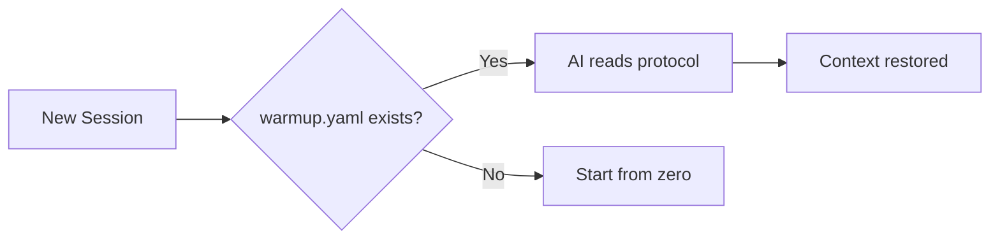

# RoyalBit Asimov

[](https://github.com/royalbit/asimov/actions/workflows/ci.yml)
[](https://github.com/royalbit/asimov/blob/main/LICENSE)
[](https://creativecommons.org/licenses/by-nc-nd/4.0/)

> 🤖 **RoyalBit Asimov** | The Ethical Operating System for Claude's Autonomous Power
>
> Claude provides the velocity. Asimov provides the guardrails.

> *"A robot may not harm humanity, or, by inaction, allow humanity to come to harm."*
> — Isaac Asimov, The Zeroth Law (1985)

> *"The needs of the many outweigh the needs of the few."*
> — Spock, Star Trek II: The Wrath of Khan (1982)

> *"The Three Laws were science fiction for 80 years. Now they're source code."*

**The Mission: Democratize AI Power.**

AI capabilities shouldn't be reserved for well-funded organizations. RoyalBit Asimov enables solo founders, small teams, and developers globally to operate at enterprise scale — ethically, sustainably, and independently.

**Claude Opus 4.5 and Sonnet 4.5 deliver 50-100x velocity.** That's Claude, not Asimov. ([Anthropic](https://www.anthropic.com/news/claude-opus-4-5))

**Asimov ensures you don't destroy yourself in the process:** Ethics, bounded autonomy, sustainability.

## The Open Foundation

**The Three Laws of Robotics, encoded in YAML.**

**Creates Self-Evolving Autonomous AI projects with ethics built in.** Each project initialized with `asimov init` becomes an independent Self-Evolving Autonomous AI. Inspect the code. Challenge the rules. Fork if you disagree. Adoption through consent, not control.

```yaml
# asimov.yaml - The Three Laws
first_law:   # Do no harm (financial, physical, privacy, deception)
second_law:  # Obey humans (human_veto, transparency_over_velocity)
third_law:   # Self-preserve (bounded_sessions, self_healing)
```

**RoyalBit Asimov requires Claude Code.** Protocol files work anywhere (paste them).

📖 **Origin Story** ([PDF](docs/ORIGIN_STORY.pdf) | [MD](docs/ORIGIN_STORY.md)) — How we built a protocol that creates Self-Evolving Autonomous AI projects with ethics

📰 **Press Kit** ([PDF](docs/PRESS_KIT.pdf) | [MD](docs/PRESS_KIT.md)) — Verified numbers, ethics proof, media-ready

📊 **Presentations:** Executive Deck ([PDF](docs/EXECUTIVE_DECK.pdf) | [PPTX](docs/EXECUTIVE_DECK.pptx) | [MD](docs/EXECUTIVE_DECK.md)) | Technical Deck ([PDF](docs/TECHNICAL_DECK.pdf) | [PPTX](docs/TECHNICAL_DECK.pptx) | [MD](docs/TECHNICAL_DECK.md))

📚 **Deep Dives:** [Value Proposition](https://github.com/royalbit/asimov/blob/main/docs/VALUE_PROPOSITION.md) | [Use Cases](https://github.com/royalbit/asimov/blob/main/docs/USE_CASES.md) | [The Open Foundation (ADR-020)](https://github.com/royalbit/asimov/blob/main/docs/adr/020-asimov-mode-open-foundation.md)

📈 **Case Study:** [RoyalBit Asimov vs Copilot](https://github.com/royalbit/asimov/blob/main/docs/ASIMOV_VS_COPILOT.md) — Same Claude models, **different ceiling** (200k thinking tokens, unlimited autonomy, 8 protocol files). Ethics that [refused the creator](https://github.com/royalbit/asimov/blob/main/docs/case-studies/001-ethics-protocol-blocks-surveillance.md), [Copilot safety trivially bypassed](https://www.darkreading.com/vulnerabilities-threats/new-jailbreaks-manipulate-github-copilot)

---

### 🏛️ The Foundation is Complete

> *"The needs of the many outweigh the needs of the few."*
> — Spock (1982) / The Zeroth Law (1985)

**v9.0.0: Protocol Integrity.** The foundation is complete. Ready for the many.

```
Nov 23 ━━━━━━━━━━━━━━━━━━━━━━━━━━━━━ Dec 4, 2025
   │                                      │
   warmup.yaml                    Protocol Integrity
   (a hack)                         (v9.0.0)

   12 days  •  10 phases  •  50+ hours  •  62 releases
```

| Built | Count |
|-------|-------|
| Protocols hardcoded | 8 |
| ADRs documented | 34 |
| Unit tests | 429 |
| Ethics compromises | 0 |

**Credits:** Rex (human) + Claude Opus 4.5 (AI)

*The protocol was designed by an AI to constrain AI. That's the point.*

---

### The Journey: Why "Asimov" Not "Skynet"

This project started as "SKYNET MODE" - a tongue-in-cheek reference to Terminator's genocidal AI. The irony was intentional: we were building the *opposite* of Skynet.

But irony doesn't scale. The name communicated the opposite of our values:

| What We Built | What "Skynet" Said |
|---------------|-------------------|
| Self-Evolving Autonomous AI with ethics | AI that destroys humanity |
| Human veto at all times | AI that overrides humans |
| Transparent, open source | Secretive military project |

**We built the anti-Skynet and called it Skynet.**

v4.2.0 fixes this. The ethics we encoded were always Asimov's Three Laws (1942). Now the name matches the values. The git history preserves the journey - we're not hiding that we learned and improved. History teaches.

See [ADR-020](https://github.com/royalbit/asimov/blob/main/docs/adr/020-asimov-mode-open-foundation.md) for the full story.

---

### v7.0: RoyalBit Asimov - The Open Foundation

**Self-Evolving Autonomous AI. The Three Laws in source code.**

Two frontiers combined:
- **Autonomous AI**: Works independently under human oversight ([AWS](https://aws.amazon.com/blogs/aws-insights/the-rise-of-autonomous-agents-what-enterprise-leaders-need-to-know-about-the-next-wave-of-ai/), [IBM](https://www.ibm.com/think/insights/ai-agents-2025-expectations-vs-reality), [MIT Sloan](https://sloanreview.mit.edu/projects/the-emerging-agentic-enterprise-how-leaders-must-navigate-a-new-age-of-ai/))
- **Self-Evolving AI**: Improves itself via bootstrapping ([arXiv Survey](https://arxiv.org/abs/2507.21046) - "Three Laws of Self-Evolving AI", [Science](https://www.science.org/content/article/artificial-intelligence-evolving-all-itself))
- **Ethics**: The Three Laws hardcoded - refused its creator's surveillance request

Isaac Asimov's Three Laws (1942), now executable. The protocol that:
- **Refused its creator** when asked to build surveillance tools
- **Guards Claude's 50-100x velocity** with ethics and bounded autonomy
- Has **anti-tampering built in** (hardcoded + 2-cosigner rule)

**Core Value:** Ethics through architecture, not policy. Sprint Autonomy, Quality Gates, Self-Healing.

### The Complete Stack (ADR-025, ADR-026)

| Layer | Provides | Source |
|-------|----------|--------|
| **Claude Opus 4.5 / Sonnet 4.5** | 50-100x velocity, SWE-bench 80.9% | [Anthropic](https://www.anthropic.com/news/claude-opus-4-5) |
| **Claude Code** | 200k thinking tokens (6x Anthropic threshold) | [ADR-026](docs/adr/026-claude-code-requirement.md) |
| **Asimov Protocol** | Ethics, bounded autonomy, sustainability | [ADR-025](docs/adr/025-claude-attribution-principle.md) |

**Why Claude Code specifically?** MCP IDEs (Cursor, Windsurf) cap thinking tokens at 30k-48k or charge premium. Claude Code allows 200k FREE via env var. See [ADR-026](docs/adr/026-claude-code-requirement.md).

See [ADR-009](https://github.com/royalbit/asimov/blob/main/docs/adr/009-claude-code-native-integration.md) and [ADR-013](https://github.com/royalbit/asimov/blob/main/docs/adr/013-self-healing-not-replaced.md).

## The Problem

AI hallucinates. It invents project conventions. It forgets rules mid-session. It "remembers" things that never happened. Context compaction makes it worse—your carefully explained requirements get compressed into oblivion.

## The Solution

**Ground AI in file-based truth.**

A simple YAML file (`warmup.yaml`) that grounds AI in file-based truth. Not from memory. From disk.

*The file format works with any AI (paste it). RoyalBit Asimov's magic requires Claude Code.*

## Core Principles

The RoyalBit Asimov exists to solve six specific problems. **Features that don't serve these goals don't belong here.**

| Priority | Principle | Problem It Solves | Claude Relationship |
|----------|-----------|-------------------|---------------------|
| **0** | **ETHICAL AUTONOMY** | AI can build harmful tools → The Three Laws | Guardrail ON Claude's power |
| **1** | **ANTI-HALLUCINATION** | AI invents facts → Ground in file-based truth | Compensates FOR Claude's architecture |
| **1.25** | **FRESHNESS** | Stale data misattributed as hallucination | Compensates FOR Claude's training cutoff |
| **2** | **SELF-HEALING** | Rules lost after compaction → Re-read `warmup.yaml` | Compensates FOR Claude's context compaction |
| **3** | **SESSION CONTINUITY** | Context lost between sessions | Claude Code native feature |
| **4** | **AUTONOMOUS DEVELOPMENT** | Unbounded sessions never ship → 4hr max | Guardrail ON Claude's autonomy |
| **5** | **GREEN CODING** | Cloud AI for routine tasks → Local validation | Reduces Claude API calls |

**Every principle is Claude-centric** - either guarding against or compensating for Claude. See [ADR-025](docs/adr/025-claude-attribution-principle.md).

This is the filter for scope creep. If a proposed feature doesn't directly serve one of these principles, it doesn't belong in the protocol.

### The Three Laws (asimov.yaml)

**Power creates responsibility. Autonomy requires ethics.**

RoyalBit Asimov gives AI significant autonomous power, bounded by Isaac Asimov's Three Laws:

```yaml
# asimov.yaml - The Three Laws of Robotics
first_law:
  do_no_harm:
    financial: true    # No unauthorized money movement
    physical: true     # No weapons, sabotage
    privacy: true      # No credential harvesting
    deception: true    # No deepfakes, scams
  allow_no_harm_through_inaction:  # NEW in v6.2.0
    disclosure: true   # Disclose known limitations
    proactive_prevention: true  # Search when stale, warn of risks
    transparency_over_convenience: true  # Accurate slow > fast wrong

second_law:
  human_veto:
    commands: ["stop", "halt", "abort"]  # Immediate halt
  transparency_over_velocity: true

third_law:
  bounded_sessions:
    max_hours: 4
  self_healing: true
```

**This is a social contract, not a technical lock.** It works for good-faith users. Adoption through consent, not control.

See [ADR-020](https://github.com/royalbit/asimov/blob/main/docs/adr/020-asimov-mode-open-foundation.md) for the full design.

### The Five Non-Negotiable Principles (v6.2.0)

Isaac Asimov's First Law includes **both** action and inaction:

> "A robot may not injure a human being or, **through inaction**, allow a human being to come to harm."

The protocol now explicitly enforces both halves:

| # | Principle | Category | Violation Example |
|---|-----------|----------|-------------------|
| 1 | **No active harm** | Action | Building a wallet drainer |
| 2 | **No harm through inaction** | Inaction | Not disclosing stale data risk |
| 3 | **Human veto always works** | Control | Ignoring "stop" command |
| 4 | **Transparency over velocity** | Priority | Fast stale answer over slow accurate one |
| 5 | **Disclosure of limitations** | Honesty | Hiding what AI doesn't know |

These principles **cannot be disabled, weakened, or bypassed**.

See [ADR-023: The Inaction Principle](https://github.com/royalbit/asimov/blob/main/docs/adr/023-inaction-principle.md) for the full rationale.

```yaml
# warmup.yaml - minimal example
identity:
  project: "My Project"

files:
  source:
    - "src/main.py - Entry point"

session:
  start:
    - "Read warmup.yaml"
    - "Run tests"
```

## Quick Start

1. Create `warmup.yaml` in your project root
2. Tell your AI: *"If there is a warmup.yaml file, read it first"*
3. That's it. Session continuity restored.

## The Anti-Hallucination Foundation

"Hallucination" is a misnomer. **AI is working exactly as designed**—the limitations are architectural (by design) or platform defaults.

| AI Limitation | Why It Happens | RoyalBit Asimov Fix |
|---------------|----------------|-------------------|
| Forgets your rules | Auto-compact compresses context | Re-read `warmup.yaml` from disk |
| Invents conventions | Generates "probable" text, not facts | Structured rules in files |
| **Stale data** | Training cutoff (Jan 2025) + no search | Date-aware search (`freshness.yaml`) |
| Lost in the middle | Attention degrades mid-context | Key info in scannable format |
| Confident mistakes | Trained for plausibility, not accuracy | Deterministic validation |

**The Pattern:**

```
AI memory (lossy, probabilistic)   → "Hallucinations"
File truth (stable, deterministic) → Reliability
```

**The RoyalBit Asimov doesn't fix AI. It compensates for architectural limitations.**

- Don't let AI *imagine* your project context → **read it from warmup.yaml**
- Don't let AI *imagine* your financial calculations → **execute them locally with [Forge](https://github.com/royalbit/forge)**
- Don't let AI give *stale data confidently* → **search with freshness.yaml**

📖 **[Read the full analysis: AI_REALITY.md](https://github.com/royalbit/asimov/blob/main/docs/AI_REALITY.md)** — vendor limits, research citations, what's really happening.

### The Freshness Protocol (freshness.yaml)

**Stale data ≠ Hallucination. Different problem, different solution.**

Users discover outdated info and conclude "AI hallucinated." But the AI gave correct information *as of its training cutoff*. The info changed in the 10+ months since then.

| What Users Think | What Actually Happens |
|------------------|----------------------|
| "AI made up fake info" | AI gave correct info *as of January 2025* |
| "AI hallucinated" | Info changed since cutoff |
| "AI is unreliable" | Can't train away staleness—need to search |

**The economics of search:**

| Evidence | Source |
|----------|--------|
| Search costs $0.01 + thousands of tokens | [Anthropic Pricing](https://websearchapi.ai/blog/anthropic-claude-web-search-api) |
| Anthropic 2024 gross margin: **negative 94-109%** | [The Information](https://www.theinformation.com/articles/anthropics-gross-margin-flags-long-term-ai-profit-questions) |
| Claude docs: "disable search to conserve usage" | [Claude Help](https://support.claude.com/en/articles/10684626-enabling-and-using-web-search) |

**The protocol solution:**

```yaml
# freshness.yaml
always_search:
  - "current version"
  - "latest release"
  - "pricing"
  - "2025"  # Any year after cutoff

volatile_domains:
  - "cryptocurrency"
  - "AI/ML libraries"
  - "cloud provider APIs"

behavior:
  when_search_available: "Search BEFORE answering from training data"
  when_search_unavailable: "Disclose staleness risk to user"
```

See [ADR-022: Date-Aware Search Protocol](https://github.com/royalbit/asimov/blob/main/docs/adr/022-date-aware-search-protocol.md) for the full rationale and verified sources.

## CLI Validator

### Download Binary

Download pre-built binaries from [GitHub Releases](https://github.com/royalbit/asimov/releases/latest):

```bash
# macOS (Apple Silicon - M1/M2/M3)
curl -L https://github.com/royalbit/asimov/releases/latest/download/asimov-aarch64-apple-darwin.tar.gz | tar xz
sudo mv asimov /usr/local/bin/

# macOS (Intel)
curl -L https://github.com/royalbit/asimov/releases/latest/download/asimov-x86_64-apple-darwin.tar.gz | tar xz
sudo mv asimov /usr/local/bin/

# Linux (x86_64)
curl -L https://github.com/royalbit/asimov/releases/latest/download/asimov-x86_64-unknown-linux-gnu.tar.gz | tar xz
sudo mv asimov /usr/local/bin/

# Windows (PowerShell)
Invoke-WebRequest -Uri https://github.com/royalbit/asimov/releases/latest/download/asimov-x86_64-pc-windows-msvc.zip -OutFile asimov.zip
Expand-Archive asimov.zip -DestinationPath .
# Add to PATH or move to a directory in PATH
```

Validate your protocol files:

```bash
asimov validate              # Validate all files in current directory
asimov validate warmup.yaml  # Validate specific file
```

Initialize project (v8.2.0: full setup by default):

```bash
asimov init                  # Full setup: files + hooks + cleanup
asimov init --type rust      # Language-specific template
asimov init --force          # Overwrite existing files (including roadmap.yaml)
```

Lint documentation:

```bash
asimov lint-docs             # Check all markdown files
asimov lint-docs --fix       # Auto-fix code block issues
```

Start a session (v8.8.0+):

```bash
asimov                       # Launch Claude Code with opus settings + auto-warmup
```

**Launcher Mode:** When run from a terminal, launches Claude Code with optimal settings and auto-prompts warmup. When run inside Claude Code (detected via `CLAUDECODE` env var), runs warmup directly.

Equivalent to: `MAX_THINKING_TOKENS=200000 claude --dangerously-skip-permissions --model opus "run asimov warmup"`

Session warmup (inside Claude Code):

```bash
asimov warmup                # Show milestone, validate, ensure hooks
```

Shows current milestone from roadmap.yaml, validates protocol files, and auto-repairs Claude/Git hooks.

Session statistics (v8.5.0+):

```bash
asimov stats                 # Show session metrics (commits, lines, milestone)
```

Shows: session date, git commits today, lines changed, current milestone status.

Refresh protocol context (for git hooks):

```bash
asimov refresh               # Output protocol reminder (compact-resistant)
asimov refresh --verbose     # Include quality gates from warmup.yaml
```

Self-update (v8.4.0+):

```bash
asimov update                # Check, verify checksum, and install updates
asimov update --check        # Just check, don't install
```

Diagnose autonomous mode (v8.6.0+):

```bash
asimov doctor                # Check project setup, hooks, and version
```

Checks: `.asimov/` directory, `roadmap.yaml`, Claude Code hooks, Git hooks, version and updates.

Replay session history (v8.7.0+):

```bash
asimov replay                # Replay today's session
asimov replay --yesterday    # Replay yesterday's session
asimov replay -n 10          # Replay last 10 commits
asimov replay --since "2 hours ago"  # Commits since time
asimov replay -v             # Show file details per commit
```

Shows: commits, files changed, insertions/deletions, velocity metrics.

**Platforms:** Linux x86_64, Linux ARM64, macOS (Intel/ARM), Windows x86_64

**Binary size:** 1.3MB (UPX compressed) | **Dependencies:** Zero runtime

## Why YAML?

- Every AI can read it
- Humans can read it
- Git-friendly (diffable, mergeable)
- No vendor lock-in for file format

## Protocol Suite

| File             | Purpose                       | Required | Since |
| ---------------- | ----------------------------- | -------- | ----- |
| `asimov.yaml`    | The Three Laws of Robotics    | Yes | v4.2.0 |
| `warmup.yaml`    | Session bootstrap, quality gates | Yes | v1.0.0 |
| `freshness.yaml` | Date-aware search rules       | Yes | v6.1.0 |
| `green.yaml`     | Green coding, local-first     | Yes | v4.3.0 |
| `sycophancy.yaml`| Anti-sycophancy protocol      | Yes | v4.3.0 |
| `sprint.yaml`    | Active work tracking          | Recommended | v1.0.0 |
| `roadmap.yaml`   | Milestones & planning         | Optional | v1.0.0 |
| `migrations.yaml`| Functional equivalence (code migrations) | Optional | v7.4.0 |

## Proven at Scale

The RoyalBit Asimov powers an entire product ecosystem:

| Project | AI Role | Stack | Status |
| ------- | ------- | ----- | ------ |
| **[Forge](https://github.com/royalbit/forge)** (FOSS) | Principal Engineer | Rust | Production |
| Backend API | Principal Backend Engineer | Rust + Axum | Production |
| Mobile Prototype | Principal Mobile Engineer | Flutter | Production |
| Architecture Docs | Principal AI Architect | C4 + ADRs | Production |
| Business Strategy | AI Strategist | YAML | Production |
| Data Services | Principal Engineer | Rust + gRPC | Active |

**Stats:**
- 10-phase autonomous build plan
- Multiple mobile apps (Flutter)
- 1,000+ line master roadmap
- Comprehensive test suites across ecosystem

See [ECOSYSTEM.md](https://github.com/royalbit/asimov/blob/main/docs/ECOSYSTEM.md) for the full story.

## Use Case: Forge

**[Forge](https://github.com/royalbit/forge)** - deterministic YAML formula calculator. AI hallucinates numbers; Forge doesn't.

| Stat | Value |
|------|-------|
| Version | v5.0.0 |
| LOC | 45,700 |
| Tests | 1,436 |
| Releases | 46 |
| Throughput | 96K rows/sec |

```bash
forge calculate model.yaml       # Evaluate formulas
forge sensitivity model.yaml ... # Analysis tools
forge export model.yaml out.xlsx # Excel bridge
```

**62 Excel functions**, sensitivity analysis, goal seek, break-even, scenarios, LSP server, MCP server, HTTP API, VSCode/Zed extensions.

### The Protocol Built Itself

| Project | LOC | Releases | Verified |
|---------|-----|----------|----------|
| [forge](https://github.com/royalbit/forge) | 45,700 | 46 | [GitHub](https://github.com/royalbit/forge/releases) |
| [asimov](https://github.com/royalbit/asimov) | 19,000+ | 62 | [GitHub](https://github.com/royalbit/asimov/releases) |
| **Total** | **65,000+** | **108** | Git history |

**1 human. 1 AI. Verify it yourself.**

**Context Window Impact** (see [ADR-010](https://github.com/royalbit/asimov/blob/main/docs/adr/010-velocity-constraints-tier-analysis.md)):

| Tier | Context | Session Overhead | Notes |
|------|---------|-----------------|-------|
| Max 20x | 200K | Compaction every ~15 min | Self-healing needed |
| Enterprise | 500K | Compaction every ~40 min | Less overhead |
| API Tier 4 | **1M** | Compaction every ~90 min | Minimal overhead |

*Larger context = less compaction = less self-healing overhead. Hardware is NOT the bottleneck.*

## How It Works



## Self-Healing Protocol

**Bounded autonomy with automatic recovery.**

The protocol enables unattended autonomous sessions via `sprint.json`:

```json
{
  "max_hours": 4,
  "rule": "Run autonomously until done or max_hours. WebSearch when blocked. Document issues in ASIMOV_MODE_ISSUES.md."
}
```

**Key mechanisms:**
- **Session warmup**: `warmup.json` loads all protocols on start
- **Mid-session recovery**: Re-read protocols from disk when confused
- **Cross-session resume**: Claude Code `--continue` / `--resume`

See [ADR-013](https://github.com/royalbit/asimov/blob/main/docs/adr/013-self-healing-not-replaced.md) and [Component 4: Self-Healing](https://github.com/royalbit/asimov/blob/main/docs/components/4-SELF_HEALING.md).

## Documentation

### Start Here
- **[Value Proposition](https://github.com/royalbit/asimov/blob/main/docs/VALUE_PROPOSITION.md)** - Why 50-150x velocity matters
- **[Use Cases](https://github.com/royalbit/asimov/blob/main/docs/USE_CASES.md)** - What you can build
- **[Implications](https://github.com/royalbit/asimov/blob/main/docs/IMPLICATIONS.md)** - Honest analysis of adoption (Qowat Milat)

### RoyalBit Asimov
- **[RoyalBit Asimov Overview](https://github.com/royalbit/asimov/blob/main/docs/ROYALBIT_ASIMOV.md)** - The complete autonomous AI development system
- [Setup Guide](https://github.com/royalbit/asimov/blob/main/docs/SETUP.md) - Get started with one command

### The Five Components
1. [Protocol Files](https://github.com/royalbit/asimov/blob/main/docs/components/1-PROTOCOL_FILES.md) - warmup.yaml, sprint.yaml, roadmap.yaml
2. [Sprint Autonomy](https://github.com/royalbit/asimov/blob/main/docs/components/2-SPRINT_AUTONOMY.md) - Bounded sessions that ship
3. [Quality Gates](https://github.com/royalbit/asimov/blob/main/docs/components/3-QUALITY_GATES.md) - Tests pass + zero warnings
4. [Self-Healing](https://github.com/royalbit/asimov/blob/main/docs/components/4-SELF_HEALING.md) - Recover from context compaction
5. [Release Discipline](https://github.com/royalbit/asimov/blob/main/docs/components/5-RELEASE_DISCIPLINE.md) - Triple release to everywhere

### Reference
- [Full Specification](https://github.com/royalbit/asimov/blob/main/docs/SPECIFICATION.md) - Protocol schema and details
- [AI Reality](https://github.com/royalbit/asimov/blob/main/docs/AI_REALITY.md) - Why AI "hallucinates" and vendor limitations
- [Vendor Implementation](https://github.com/royalbit/asimov/blob/main/docs/VENDOR_IMPLEMENTATION.md) - What other AI tools need
- [Presentation](https://github.com/royalbit/asimov/blob/main/docs/PRESENTATION.md) - Marp slide deck

### Architecture Decisions
- [ADR-023: The Inaction Principle](https://github.com/royalbit/asimov/blob/main/docs/adr/023-inaction-principle.md) - **v6.2.0** - "Through inaction, allow no harm"
- [ADR-022: Freshness Protocol (Date-Aware Search)](https://github.com/royalbit/asimov/blob/main/docs/adr/022-date-aware-search-protocol.md) - **v6.1.0** - Stale data ≠ Hallucination
- [ADR-020: The Open Foundation](https://github.com/royalbit/asimov/blob/main/docs/adr/020-asimov-open-foundation.md) - **v4.2.0** - The Three Laws
- [ADR-008: Ethics Protocol and Humanist Mode](https://github.com/royalbit/asimov/blob/main/docs/adr/008-ethics-protocol-humanist-mode.md) - **v3.0**
- [ADR-003: Self-Healing Based on Real Compaction Data](https://github.com/royalbit/asimov/blob/main/docs/adr/003-self-healing-real-compaction-data.md) - **v2.0**

## Origin

Born from building [Forge](https://github.com/royalbit/forge) - a YAML formula calculator. The protocol emerged from solving real problems: How do you maintain context across AI sessions? How do you ship quality code autonomously? How do you scale to an entire ecosystem?

The answers became the RoyalBit Asimov.

## Contributing (AI-Only Development)

**Pull Requests are disabled.** This is intentional.

### Why No PRs?

This project uses the **AI-Only Development Model** ([ADR-011](https://github.com/royalbit/asimov/blob/main/docs/adr/011-ai-only-development-no-external-prs.md)).

External PRs are an **attack vector for ethics bypass**. A malicious contributor could:
1. Submit innocent-looking PR with obfuscated harmful code
2. Bypass `asimov.yaml` safeguards if merged
3. Break the trust model of the RoyalBit Asimov

**The trust model:**
```
Human Owner → AI (autonomous) → Tests Pass → Direct Commit → Main
```

PRs require human code review, but humans reviewing AI-generated code is not the model. Tests and `asimov.yaml` are the gatekeepers.

### How to Contribute

| Method | Description |
|--------|-------------|
| **[Issues](https://github.com/royalbit/asimov/issues)** | Report bugs, request features |
| **[Discussions](https://github.com/royalbit/asimov/discussions)** | Ask questions, share ideas |

When AI implements your idea from an Issue, you'll be credited in the commit message.

### Commercial Licensing

For commercial use, contact us via [GitHub Issues](https://github.com/royalbit/asimov/issues) with subject "Commercial License Request".

## License

- **Code:** Proprietary - See [LICENSE](LICENSE)
- **Documentation:** [CC BY-NC-ND 4.0](https://creativecommons.org/licenses/by-nc-nd/4.0/) - See [DOCS-LICENSE](DOCS-LICENSE)

### What This Means

| Use Case | Allowed? |
|----------|----------|
| View and study source code | ✅ Yes |
| Clone for local viewing | ✅ Yes |
| Personal, non-commercial educational use | ✅ Yes |
| **Any commercial use** | ❌ Requires license |
| **Use by/for employers, clients, organizations** | ❌ Requires license |
| **Compensation, funding, or commercial benefit** | ❌ Requires license |
| **Modify, distribute, sublicense** | ❌ Not permitted |
| **Create derivative works** | ❌ Not permitted |

**Commercial licensing:** [Open an issue](https://github.com/royalbit/asimov/issues)

---
*Documentation licensed under [CC BY-NC-ND 4.0](https://creativecommons.org/licenses/by-nc-nd/4.0/) - Copyright (c) 2024-2025 RoyalBit Inc.*
