# The Forge Protocol Ecosystem

How one protocol powers an entire product suite.

## The Story

The Forge Protocol wasn't designed in isolation. It emerged from building real products:

1. **Forge** (FOSS) - A YAML formula calculator that needed autonomous development
2. **A proprietary platform** - A full product ecosystem with backend, mobile apps, and business strategy

The problems we solved building Forge became the protocol. The protocol then scaled to power an entire ecosystem.

## The Ecosystem (Anonymized)

```mermaid
flowchart TB
    subgraph protocol["🔥 FORGE PROTOCOL"]
        W[warmup.yaml]
        S[sprint.yaml]
        R[roadmap.yaml]
    end

    subgraph foss["OPEN SOURCE"]
        FORGE[Forge Calculator<br/>Rust • 183 tests]
        ZED[Zed Extension<br/>WASM]
        VSCODE[VSCode Extension<br/>TypeScript]
    end

    subgraph proprietary["PROPRIETARY ECOSYSTEM"]
        API[Backend API<br/>Rust + Axum]
        PROTO[Mobile Prototype<br/>Flutter • 161 tests]
        ARCH[Architecture Docs<br/>C4 + ADRs]
        BIZ[Business Strategy<br/>Financial Models]
        ENRICH[Data Enrichment<br/>Python]
    end

    protocol --> foss
    protocol --> proprietary
```



## AI Roles Across the Ecosystem

The same AI (Claude Opus 4.5) serves different roles depending on the project:

| Repository | AI Role | Responsibilities |
| ---------- | ------- | ---------------- |
| **forge** | Principal Engineer | Full ownership of Rust codebase, 183 tests |
| **forge-zed** | Extension Developer | WASM extension, LSP integration |
| **backend-api** | Principal Backend Engineer | Attribution engine, API design, <2ms queries |
| **mobile-proto** | Principal Mobile Engineer | Flutter app, 161 tests, glassmorphism UI |
| **architecture** | Principal AI Architect | C4 diagrams, ADRs, cross-repo consistency |
| **business** | AI Strategist | Financial models, 850+ formulas |
| **data-enrich** | Principal Engineer | Data pipelines, enrichment |

## The Master Roadmap

The proprietary ecosystem has a **10-phase autonomous build plan**:

```yaml
# Anonymized structure
phases:
  phase_0: Foundation Verification
  phase_1: Backend Authentication (OAuth)
  phase_2: Core Business Logic CRUD
  phase_2.5: Trust/Reputation System (Moat #2)
  phase_3: Shared Mobile Core Package
  phase_4: App #1 (Management)
  phase_5: App #2 (User-facing)
  phase_6: App #3 (Client-facing)
  phase_7: Admin Control Center
  phase_8: Payment Processing (Stripe Connect)
  phase_9: Consumer Integration (Web/QR/POS)
  phase_10: Pilot Readiness
```

Each phase has:
- Specific steps with acceptance criteria
- Test requirements
- Dependencies on previous phases
- Phase gates for human review

## How the Protocol Enables This

### 1. Context Persistence

Each project has its own `warmup.yaml` that defines:
- Project identity and purpose
- AI ownership declaration
- Key files and architecture
- Session workflow
- Quality standards

### 2. Autonomous Execution

The workflow is simple:
```
Human: "run warmup"
AI: [loads context, presents current phase]
Human: "punch it" or "go"
AI: [executes autonomously until milestone complete]
AI: [pauses at phase gate for human review]
```

### 3. Cross-Repo Consistency

All repositories follow the same protocol:
- Same session initialization pattern
- Same quality standards (zero warnings)
- Same commit conventions
- Same phase gate structure

### 4. Master Roadmap Orchestration

The `master-roadmap.yaml` coordinates across repositories:
- Defines what's already complete
- Specifies dependencies between phases
- Lists what to reuse from existing code
- Sets acceptance criteria for the entire system

## Real Numbers

### Open Source (Forge)

| Metric | Value |
| ------ | ----- |
| Total dev time | ~45 hours |
| Major versions | 12 (v1.0 → v3.1.3) |
| Tests passing | 183 |
| Lines of Rust | 10,000+ |
| Excel functions | 60+ |
| Editor extensions | 2 (VSCode, Zed) |
| Best day | 12 releases, 64 commits |

### Proprietary Ecosystem

| Metric | Value |
| ------ | ----- |
| Repositories | 6+ |
| Master roadmap | 1,100+ lines |
| Mobile tests | 161 (prototype) |
| Demo tests | 213 |
| Financial formulas | 850+ |
| API endpoints | 15+ working |
| Database indexes | 70+ |
| Planned mobile apps | 4 |

### Attribution Engine (The Moat)

| Metric | Value |
| ------ | ----- |
| Query latency | <2ms |
| Accuracy | 97% |
| Tracking levels | 3-tier hierarchical |
| Status | Production ready |

## The Velocity Transformation

### Before Protocol

- Sessions started from scratch
- Context lost between conversations
- Human involvement in every decision
- Waiting time between sessions

### After Protocol

| Metric | Before | After |
| ------ | ------ | ----- |
| Releases per day | 1-2 | **12** |
| Context restoration | Manual | **Automatic** |
| Human involvement | Every decision | **Phase gates only** |
| Scope creep | Constant | **Eliminated** |

### The Best Day (November 25, 2025)

On a single day, using the Forge Protocol:
- **12 releases** (v2.0.0 → v3.1.1)
- **64 commits**
- Features shipped: HTTP API, XNPV/XIRR, Scenarios, Sensitivity Analysis, Zed Extension

Human equivalent: **3-6 months** of senior developer work.

## Green Coding

The Forge Protocol enables green coding practices:

### The Problem with AI Validation

Every AI API call has a carbon footprint:
- GPU power for inference
- Data center cooling
- Network transmission

**Per validation request:** ~0.25g CO2

### The Protocol's Solution

Local validation + deterministic execution:
- **Per validation:** ~0.0005g CO2
- **Reduction:** 99.6%

### At Scale

| User Type | AI Carbon | Local Carbon | Reduction |
| --------- | --------- | ------------ | --------- |
| Personal | 300g/year | 0.6g/year | 99.6% |
| Team (3) | 3.75 kg/year | 0.007 kg/year | 99.6% |
| Enterprise (20) | 62.5 kg/year | 0.125 kg/year | 99.6% |

**Enterprise savings:** Equivalent to removing 13 cars from the road for 1 day.

### Cost Savings

| User Type | AI Tokens | Local | Savings |
| --------- | --------- | ----- | ------- |
| Personal | $792/year | $0 | $792/year |
| Team (3) | $40K/year | $0 | $40K/year |
| Hedge Fund (5) | $132K/year | $0 | $132K/year |

**Why?** The protocol emphasizes deterministic validation over probabilistic AI inference.

See [GREEN_CODING.md](GREEN_CODING.md) for the full analysis.

## Why This Matters

The Forge Protocol proves that:

1. **AI can own codebases** - Not just assist, but take full responsibility
2. **Quality scales** - Zero warnings across an entire ecosystem
3. **Autonomy works** - When bounded by protocols
4. **Velocity compounds** - Each project builds on the last

## Getting Started

1. **Start small** - Add `warmup.yaml` to one project
2. **Define ownership** - Who (AI) owns what
3. **Set quality gates** - Tests must pass, zero warnings
4. **Add bounded sessions** - 4-hour max, one milestone
5. **Scale gradually** - Add `sprint.yaml`, then `roadmap.yaml`

The protocol grew organically from solving real problems. Start with the problems you have.

## The Circular Nature

The Forge Protocol was born from building Forge. Now Forge uses the Forge Protocol to build Forge. The proprietary ecosystem uses the same protocol. The protocol itself uses the protocol.

It's protocols all the way down.

---

*Built with the [Forge Protocol](https://github.com/royalbit/forge-protocol) - enabling AI autonomy in software development.*
